# @theBGuy

**Building systems that hold up under pressure.**

Software engineer building scalable web apps, developer tools, and real-time systems.

Go · TypeScript · React · React Native · PostgreSQL · Redis · Docker

---

I build backend infrastructure and the frontend interfaces that sit on top of it — at the seam where they have to hold together under load. Distributed event pipelines, developer tooling, real-time systems. 6+ years in, and the through-line isn't a language; it's correctness and usability at scale. I pick the tool that keeps the system honest, then build it so it stays that way in production.

## Selected work

<table>
  <tr>
    <td width="50%" valign="top">
      <b><a href="https://dispatch.tech">Dispatch</a></b> 
      Co-founder &amp; Lead Engineer  
      Multi-tenant SaaS webhook platform ingesting events from <b>18+ source providers</b>, routing them through filter/transform rules, and delivering to Discord, Slack, Telegram, and arbitrary HTTP endpoints. Go (Fiber) + Redis (asynq) + PostgreSQL behind a Next.js 16 / React 19 dashboard. 
      <a href="https://docs.dispatch.tech">docs.dispatch.tech</a>
    </td>
    <td width="50%" valign="top">
      <b><a href="https://gitdesktop.app">GitDesktop</a></b> 
      Creator · cross-platform, self-updating  
      GitHub Desktop's ease, taken further — and keyboard-first: the whole PR lifecycle in-app (down to offline local PRs), a GitHub Actions cockpit, plus issues, discussions, and AI across GitHub, GitLab, and Bitbucket. CLI-based, so your tokens are never stored; AI runs on whatever provider you choose, local models included. Tauri 2 + React 19 + Rust. 
      <a href="https://github.com/theBGuy/GitDesktop">github.com/theBGuy/GitDesktop</a>
    </td>
  </tr>
  <tr>
    <td width="50%" valign="top">
      <b><a href="https://github.com/blizzhackers/kolbot">kolbot</a></b> 
      Lead maintainer since 2022 · 287&#9733; / 191 forks  
      Widely used Diablo II automation framework with <b>thousands of active users</b>. Re-architected a legacy codebase into a layered module hierarchy and built a plugin system on top of it.
    </td>
    <td width="50%" valign="top">
      <b><a href="https://github.com/blizzhackers/kolbot-SoloPlay">kolbot-SoloPlay</a></b> 
      Creator &amp; lead dev · 71&#9733; / 31 forks  
      Solo-play progression automation covering all <b>7 D2 classes</b>, driven by a profile-based config layer and a progression state machine.
    </td>
  </tr>
  <tr>
    <td width="50%" valign="top">
      <b><a href="https://github.com/blizzhackers/limedrop">limedrop</a></b> 
      jQuery → React + TypeScript rewrite  
      Led a full rewrite onto React + TypeScript: Web Workers for off-thread compute, React Window virtualization, and a structured rule builder.
    </td>
    <td width="50%" valign="top">
      <b><a href="https://github.com/theBGuy/discord-semantic-search">discord-semantic-search</a></b> 
      Local-first RAG  
      Semantic search over Discord history, entirely local: Ollama embeddings into Postgres/pgvector. No data leaves the machine.
    </td>
  </tr>
</table>

More developer tooling — VS Code extensions (<a href="https://github.com/theBGuy/vs-pkg-uninstaller">vs-pkg-uninstaller</a>, <a href="https://github.com/theBGuy/vs-react-native-stylesheet-cleaner">vs-react-native-stylesheet-cleaner</a>, <a href="https://github.com/theBGuy/vsnip-check">vsnip-check</a>), a Wails desktop app (<a href="https://github.com/theBGuy/go-work-tracker">go-work-tracker</a>), and a dependency-free npm utility (<a href="https://github.com/theBGuy/array-remove">array-remove</a>) — lives across <a href="https://github.com/theBGuy?tab=repositories">my repositories</a>.

## Stack

Grouped by where it sits in the system — chosen for the job, not the language.

<b>Languages</b> &nbsp;

<b>Frontend</b> &nbsp;

<b>Backend &amp; data</b> &nbsp;

## Activity

